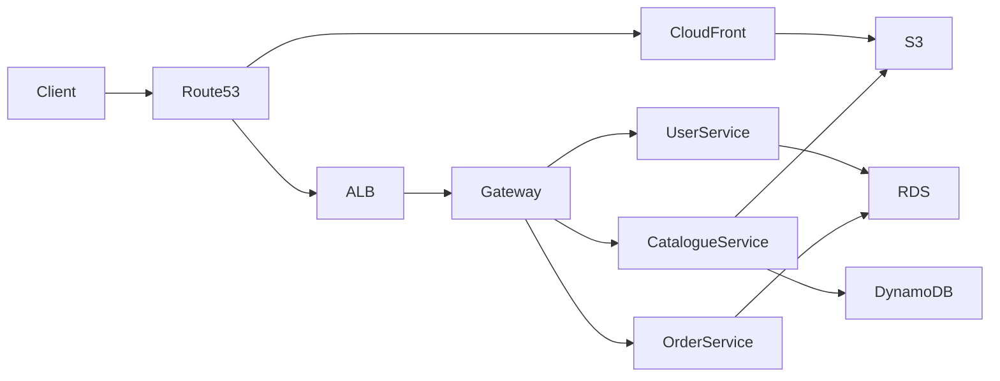
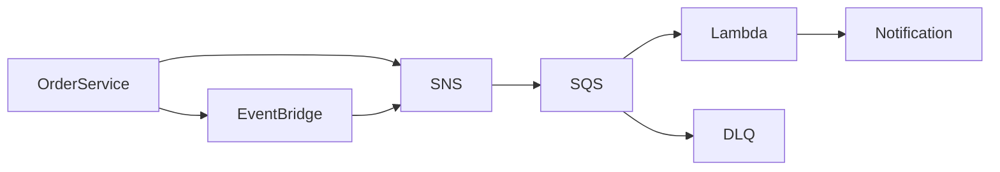

# SmartRetailX

SmartRetailX is a cloud-native retail platform built using a microservices architecture. The project is organised as a monorepo containing several independent Express.js services, an API Gateway, and a Docker Compose setup for local development and testing.

The purpose of this project is to demonstrate distributed application development concepts such as service separation, API communication, containerisation, API documentation, and scalable deployment practices.

---

## Services Overview

| Service           | Location                      | Port | Purpose                                                                                               |
| ----------------- | ----------------------------- | ---- | ----------------------------------------------------------------------------------------------------- |
| API Gateway       | `gateway/`                    | 3000 | Central entry point that routes requests to backend services and exposes aggregated API documentation |
| User Service      | `services/user-service/`      | 3001 | Handles user registration, authentication, profile management, and JWT generation                     |
| Catalogue Service | `services/catalogue-service/` | 3002 | Manages products, categories, and product search operations                                           |
| Order Service     | `services/order-service/`     | 3003 | Creates and manages orders, communicates with other services, and processes order status updates      |

All APIs follow versioned endpoints using the `/api/v1` convention.

Each service also exposes its own Swagger/OpenAPI documentation through the `/docs` endpoint.

---

## API Gateway Routing

The API Gateway acts as the single entry point for clients and forwards requests to the appropriate microservice.

| Gateway Endpoint                    | Target Service    |
| ----------------------------------- | ----------------- |
| `http://localhost:3000/users/*`     | User Service      |
| `http://localhost:3000/catalogue/*` | Catalogue Service |
| `http://localhost:3000/orders/*`    | Order Service     |

### Example Requests

Register a new user:

```bash
curl -X POST http://localhost:3000/users/api/v1/auth/register \
-H "Content-Type: application/json" \
-d '{
  "email":"shopper@example.com",
  "password":"password123",
  "name":"Shopper"
}'
```

Create a product category:

```bash
curl -X POST http://localhost:3000/catalogue/api/v1/categories \
-H "Content-Type: application/json" \
-d '{
  "name":"Electronics"
}'
```

---

## API Documentation

The gateway provides a consolidated Swagger UI containing all available service endpoints.

| URL                        | Description                |
| -------------------------- | -------------------------- |
| http://localhost:3000/docs | Combined API documentation |
| http://localhost:3001/docs | User Service API           |
| http://localhost:3002/docs | Catalogue Service API      |
| http://localhost:3003/docs | Order Service API          |

---

## Running the Application with Docker

### Prerequisites

- Docker
- Docker Compose v2 or later

From the root directory of the project:

```bash
docker compose up --build
```

This command builds and starts all services on the shared Docker network.

### Health Check

```bash
http://localhost:3000/health
```

### Stopping the Environment

```bash
docker compose down
```

---

## Payment Service Note

The Order Service is designed to communicate with a Payment Service during order creation.

For the current implementation, a dedicated payment microservice has not been included. During development, the application simulates a successful payment if the configured payment endpoint is unavailable.

A real payment provider can be integrated later by updating the `PAYMENT_SERVICE_URL` environment variable.

---

## Local Development Setup

Install dependencies:

```bash
npm install
```

Create local environment files:

```bash
cp services/user-service/.env.example services/user-service/.env
cp services/catalogue-service/.env.example services/catalogue-service/.env
cp services/order-service/.env.example services/order-service/.env
cp gateway/.env.example gateway/.env
```

Start each service in separate terminals:

```bash
npm run start:user
npm run start:catalogue
npm run start:order
npm run start:gateway
```

For local service communication, configure the Order Service environment variables as follows:

```env
CATALOGUE_SERVICE_URL=http://localhost:3002
PAYMENT_SERVICE_URL=http://localhost:3004
```

---

## Testing

The project uses Jest and Supertest for automated testing.

Available commands:

```bash
npm test

npm run test:user
npm run test:catalogue
npm run test:order
npm run test:gateway
```

Tests cover both unit and integration scenarios, with controller-level coverage targets enforced across services.

---

## Project Structure

```text
smartretailx/
├── ARCHITECTURE.md
├── README.md
├── docker-compose.yml
├── gateway/
│   ├── Dockerfile
│   ├── src/
│   └── tests/
└── services/
    ├── user-service/
    ├── catalogue-service/
    └── order-service/
```

Each service follows a consistent structure and contains:

- Source code (`src/`)
- Automated tests (`tests/`)
- Dockerfile
- OpenAPI/Swagger specification
- Environment configuration examples
- Request validation using Zod
- Centralised error handling
- Pino-based request logging

This structure helps maintain consistency across services and simplifies future expansion of the platform.

# SmartRetailX Kubernetes Deployment (Amazon EKS)

This directory contains the Kubernetes deployment configuration used to run the SmartRetailX microservices on Amazon EKS. The manifests are organised using Kustomize to separate common resources from environment-specific configurations.

## Directory Structure

```text
k8s/
├── README.md
├── base/
│   ├── kustomization.yaml
│   ├── namespace.yaml
│   ├── ingress.yaml
│   ├── user-service/
│   ├── catalogue-service/
│   ├── order-service/
│   └── gateway/
└── overlays/
    ├── dev/
    └── prod/
```

The `base` directory contains the common configuration shared by all environments, while the `dev` and `prod` overlays contain environment-specific customisations such as replica counts, resource limits, and image tags.

---

## Prerequisites

Before deploying the application, the following components should already be available:

- Amazon EKS cluster
- Worker nodes distributed across at least two Availability Zones
- AWS Load Balancer Controller
- Kubernetes Metrics Server
- Container images stored in Amazon ECR
- ACM SSL certificate
- Public subnets configured for ALB discovery

---

## Deployment

To preview the generated manifests:

```bash
kubectl kustomize k8s/overlays/dev
kubectl kustomize k8s/overlays/prod
```

Before deployment, update any placeholder values found in the Secret manifests.

Deploy the environment using:

```bash
kubectl apply -k k8s/overlays/dev
```

or

```bash
kubectl apply -k k8s/overlays/prod
```

After deployment, ensure that image references, AWS account IDs, and certificate ARNs match the target AWS environment.

---

## Kubernetes Resources

Each microservice contains a standard set of Kubernetes resources.

### Deployment

The Deployment resource is responsible for running and maintaining application pods.

Features include:

- Rolling updates
- Liveness and readiness probes
- CPU and memory requests
- Resource limits
- Pod scheduling preferences across nodes and Availability Zones

### Service

Each service is exposed internally using a ClusterIP service.

Only the API Gateway is accessible externally through the Application Load Balancer.

### ConfigMap

ConfigMaps store non-sensitive configuration values such as:

- Application ports
- Environment names
- Logging configuration
- Internal service URLs

### Secret

Secrets store sensitive configuration such as:

- JWT signing keys
- API credentials
- External service keys

The repository contains only template values and should never contain real credentials.

### Horizontal Pod Autoscaler (HPA)

The HPA automatically adjusts the number of running pods based on CPU and memory utilisation.

Default settings:

- Minimum replicas: 2
- Maximum replicas: 10

### Pod Disruption Budget (PDB)

The PDB helps maintain service availability during maintenance operations such as node upgrades or node replacements.

### Network Policies

Network policies are used to restrict communication between services and follow a least-privilege approach.

---

## Internal Traffic Flow

Application traffic follows the path shown below:

```text
Internet
   │
   ▼
AWS Application Load Balancer
   │
   ▼
API Gateway
   ├── User Service
   ├── Catalogue Service
   └── Order Service
```

The backend services are not directly accessible from the internet.

The Order Service is permitted to communicate with the Catalogue Service when validating products and processing orders.

All other communication paths are restricted unless explicitly allowed.

---

## Multi-AZ High Availability

To improve availability, the EKS cluster is deployed across multiple Availability Zones.

### Node Distribution

Worker nodes are distributed across at least two Availability Zones.

Example:

| Availability Zone | Worker Nodes |
| ----------------- | ------------ |
| AZ-A              | EKS Nodes    |
| AZ-B              | EKS Nodes    |

This ensures that the application can continue operating even if one Availability Zone becomes unavailable.

### Pod Placement

Pod anti-affinity rules encourage Kubernetes to distribute replicas across different nodes and zones whenever possible.

In the production environment, topology spread constraints are used to balance workloads evenly across Availability Zones.

This helps reduce the impact of infrastructure failures and improves overall service availability.

---

## Scalability

Horizontal Pod Autoscalers are configured to increase the number of running pods when demand increases.

Typical behaviour:

1. CPU or memory utilisation exceeds the configured threshold.
2. Additional replicas are created automatically.
3. Traffic is distributed across the new pods.
4. When utilisation decreases, excess replicas are removed.

This allows the platform to handle traffic spikes while controlling infrastructure costs.

---

## Resilience

Several mechanisms are used to improve resilience:

- Multi-AZ deployment
- Pod Disruption Budgets
- Rolling updates
- Health checks
- Load balancing
- Auto-scaling

If a node fails, Kubernetes automatically schedules replacement pods on healthy nodes.

Readiness probes ensure that traffic is only sent to healthy application instances.

---

## Environment Differences

| Configuration   | Development        | Production          |
| --------------- | ------------------ | ------------------- |
| Replicas        | 1                  | 3                   |
| HPA Range       | 1–5                | 3–10                |
| CPU Limits      | Lower              | Higher              |
| Memory Limits   | Lower              | Higher              |
| Image Tags      | Development images | Production releases |
| Topology Spread | Optional           | Enabled             |

The development environment is designed for testing and experimentation, while the production environment prioritises availability and fault tolerance.

---

## Secret Management

For demonstration purposes, Secret manifests contain placeholder values.

In a production deployment, secrets should be stored in:

- AWS Secrets Manager
- AWS Systems Manager Parameter Store

These services can be integrated with Kubernetes using External Secrets Operator or the Secrets Store CSI Driver.

This approach avoids storing sensitive information directly within source control.

---

## Verification Commands

Check the deployed resources:

```bash
kubectl -n smartretailx get deploy,svc,hpa,pdb,ingress,networkpolicy
```

View running pods and their node placement:

```bash
kubectl -n smartretailx get pods -o wide
```

Inspect the Application Load Balancer configuration:

```bash
kubectl -n smartretailx describe ingress smartretailx-gateway
```

These commands can be used to verify that the application has been deployed successfully and that workloads are distributed across the available infrastructure.

# SmartRetailX AWS Infrastructure (Terraform)

This directory contains the Terraform configuration used to provision the AWS infrastructure required for the SmartRetailX cloud platform.

The infrastructure is organised using reusable Terraform modules and separate environments for development and production. Terraform remote state is stored securely in Amazon S3 with DynamoDB state locking to prevent concurrent changes.

---

## Project Structure

```text
infra/
├── README.md
├── bootstrap/
│   └── Creates Terraform state resources
│
├── modules/
│   ├── vpc/
│   ├── eks/
│   ├── rds/
│   ├── dynamodb/
│   ├── s3/
│   ├── cloudfront/
│   ├── route53/
│   ├── messaging/
│   ├── lambda/
│   ├── iam/
│   └── secrets/
│
└── envs/
    ├── dev/
    └── prod/
```

Each module is responsible for managing one AWS service or infrastructure component. Small cost optimisation notes are included inside the modules to explain design decisions.

---

# Initial Setup

## 1. Create Terraform Remote State Resources

This step only needs to be completed once for an AWS account.

Navigate to the bootstrap folder:

```bash
cd infra/bootstrap
```

Initialise Terraform:

```bash
terraform init
```

Create the S3 bucket and DynamoDB table used for state management:

```bash
terraform apply \
-var="state_bucket_name=smartretailx-tfstate-<ACCOUNT_ID>" \
-var="aws_region=ap-south-1"
```

The S3 bucket stores Terraform state files, while DynamoDB provides state locking.

---

# Environment Configuration

Each environment has its own Terraform configuration.

Example:

```text
envs/
├── dev/
└── prod/
```

Navigate to an environment:

```bash
cd infra/envs/dev
```

Copy the backend configuration:

```bash
cp backend.hcl.example backend.hcl
```

Update:

- Terraform state bucket name
- AWS region
- DynamoDB lock table name

Create the variable file:

```bash
cp terraform.tfvars.example terraform.tfvars
```

Update environment-specific values such as:

- AWS region
- Cluster name
- Database settings
- S3 bucket names

---

# Deploy Infrastructure

Terraform modules are connected using resource references, which ensures AWS resources are created in the correct order.

The deployment flow is:

| Stage              | Terraform Modules          |
| ------------------ | -------------------------- |
| Networking         | VPC                        |
| Compute            | EKS                        |
| Storage & Database | RDS, DynamoDB, S3, Secrets |
| CDN & DNS          | CloudFront, Route53        |
| Messaging          | SNS, SQS, EventBridge      |
| Permissions        | IAM                        |

Run:

```bash
terraform init -backend-config=backend.hcl
```

Review changes:

```bash
terraform plan -var-file=terraform.tfvars
```

Deploy:

```bash
terraform apply -var-file=terraform.tfvars
```

---

# Application Deployment

After the AWS infrastructure is ready:

1. Build Docker images.
2. Push images to Amazon ECR.
3. Configure Kubernetes access.
4. Deploy application manifests.

Example:

```bash
kubectl apply -k k8s/overlays/prod
```

The Kubernetes layer manages the application containers, while Terraform manages the AWS infrastructure.

---

# Development vs Production Configuration

| Resource        | Development           | Production                     |
| --------------- | --------------------- | ------------------------------ |
| NAT Gateway     | Single NAT Gateway    | NAT Gateway per AZ             |
| EKS Nodes       | Spot instances        | On-demand instances            |
| EKS Capacity    | Minimum 1 node        | Minimum 3 nodes                |
| Database        | Aurora Serverless v2  | Multi-AZ Aurora cluster        |
| DynamoDB Backup | Disabled              | Point-in-time recovery enabled |
| CloudFront      | Price Class 100       | Price Class 200                |
| Secrets         | Short recovery period | 30-day recovery window         |

Development settings prioritise lower cost, while production settings focus on availability and resilience.

---

# Terraform Outputs

After deployment, useful information can be retrieved using:

```bash
terraform output eks_cluster_name

terraform output eks_cluster_endpoint

terraform output rds_cluster_endpoint

terraform output dynamodb_table_name

terraform output cloudfront_domain_name

terraform output sns_order_events_arn

terraform output sqs_notification_arn
```

---

# Application Request Flow



The API traffic enters through Route53 and the Application Load Balancer before reaching the API Gateway running inside Amazon EKS.

Static content is served through CloudFront and S3.

---

# Event Processing Flow



Order updates are published as events instead of directly calling every dependent service.

This improves scalability and reduces coupling between services.

---

# Cost Optimisation Decisions

| Component       | Design Decision                                                    |
| --------------- | ------------------------------------------------------------------ |
| VPC             | Reduced NAT usage in development environments                      |
| EKS             | Uses managed node groups and Spot instances where appropriate      |
| RDS             | Serverless database option for development                         |
| DynamoDB        | Uses on-demand capacity mode                                       |
| S3              | Uses lifecycle rules and CloudFront integration                    |
| CloudFront      | Uses lower price classes where possible                            |
| Messaging       | Uses managed AWS messaging services instead of self-hosted brokers |
| Lambda          | Uses ARM architecture and event-based execution                    |
| IAM             | Uses restricted permissions instead of broad access                |
| Secrets Manager | Stores only required sensitive values                              |

---

# Validation

Format Terraform files:

```bash
terraform fmt -recursive
```

Validate development environment:

```bash
cd infra/envs/dev

terraform init -backend=false

terraform validate
```

Validate production environment:

```bash
cd ../prod

terraform init -backend=false

terraform validate
```

A successful validation confirms that the Terraform configuration is syntactically correct before deployment.
